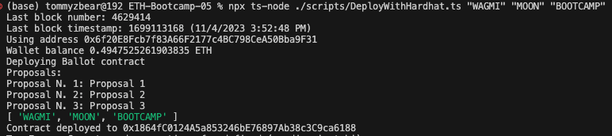
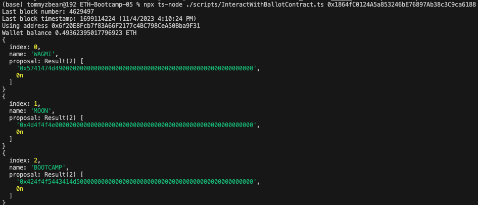
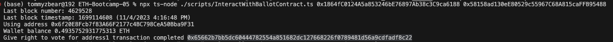
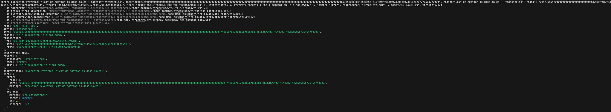
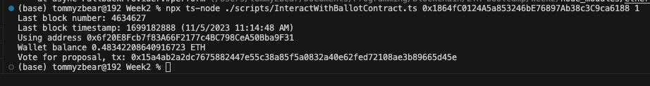
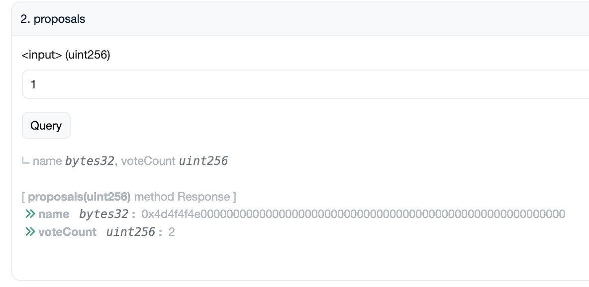

# Scripts

- scripts/DeployWithHardhat.ts
- scripts/InteractWithBallotContract.ts

## Contract Deployments

### Transaction Hash: https://sepolia.etherscan.io/tx/0xe949369a5d7dbbedc781c0c2f774166132195c3f7fefb0a4cc0e9abe13bad14a

### Contract Address: https://sepolia.etherscan.io/address/0x1864fc0124a5a853246be76897ab38c3c9ca6188

## Read Proposals

## Give Voting Right

### Transaction Hash1: https://sepolia.etherscan.io/tx/0x8f8bfa44833dc58523725623d51b70afb1a5d291320fe4a0795c3a1e35b7ea49

### Transaction Hash2: https://sepolia.etherscan.io/tx/0x65662b7bb5dc60444782554a851682dc127668226f0789481d56a9cdfadf8c22

## Reverted Delegation

Delegation to self is reverted with reason `Self-delegation is disallowed.`

## Delegate Voting Right

Delegate voting right to another address

### Transaction Hash1: https://sepolia.etherscan.io/tx/0xda3e9c6e6a52a6ef68bb376f2ea49cc12e492977bb934fab773a5a653dad1bb9

## Vote for Proposal

Vote for a proposal

### Transaction Hash: https://sepolia.etherscan.io/tx/0x15a4ab2a2dc7675882447e55c38a85f5a0832a40e62fed72108ae3b89665d45e

## Check votes on etherscan

Proposal should receive 2 votes, since the wallet that initiate the transaction has 1 delegation

