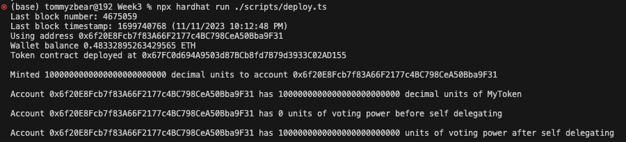
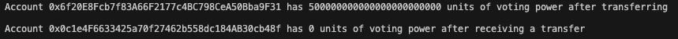
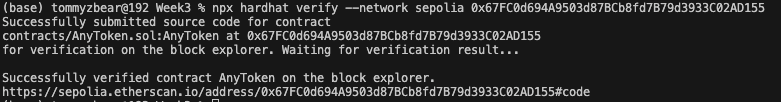
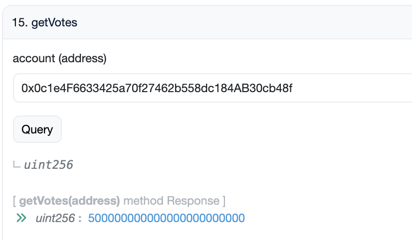
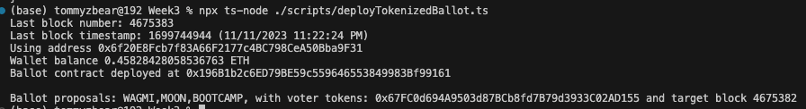
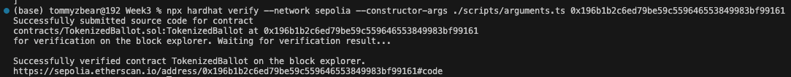
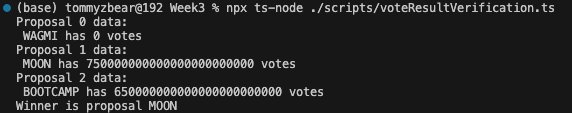

# Scripts

- scripts/deploy.ts (Deployment for AnyToken.sol which is our tokenized voting contract)
- scripts/delegateTo.ts (Delegation to a seperate wallet address)

## Token Contract Deployments

### Transaction Hash: https://sepolia.etherscan.io/tx/0x05fc3d0d572a1809c4f793c566de13e48b256056c518d9f2f81680463e988f74

### Contract Address: https://sepolia.etherscan.io/address/0x67FC0d694A9503d87BCb8fd7B79d3933C02AD155

### 2nd Wallet Self-delegation tx: https://sepolia.etherscan.io/tx/0xbc63bb69be83ad14195609fddbe2e4775925b093b367d5dac6c2382a58527c2f

### 3rd Wallet token mint tx: https://sepolia.etherscan.io/tx/0x9ad7dbd58d4603615a8b0e5627dc3d4ee0dd288fff197562ae11461a7f97d94b

### 3rd Wallet vote delegation tx: https://sepolia.etherscan.io/tx/0xea2423f8655b0ef23b95fe602f551f304877c1553a5abaa7964c6e9d3c2caa7b

### 4th Wallet token mint tx: https://sepolia.etherscan.io/tx/0x1f99067a702d0b4830fbab52bd21272c9b9c1cd581634a40f469cef5e6cc3509

### 4th Wallet vote delegation tx: https://sepolia.etherscan.io/tx/0xedbf013d1f8ad194be14de339a3d8ce5594d429b0b194c324bd4e27c28f1554c

## Ballot deployment

### Transaction Hash: https://sepolia.etherscan.io/tx/0x43215b97eec9f0850543ee606cf9f7c7f3e09b7fe4c7eb67b5166ef272acb2a9

### Contract Address: https://sepolia.etherscan.io/address/0x196b1b2c6ed79be59c559646553849983bf99161

### Ballot contract verification

### Ballot vote histories: https://sepolia.etherscan.io/address/0x196b1b2c6ed79be59c559646553849983bf99161

## Verify winner

