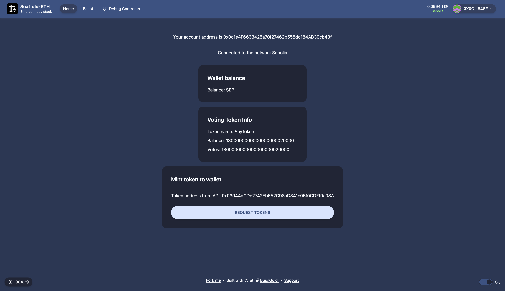
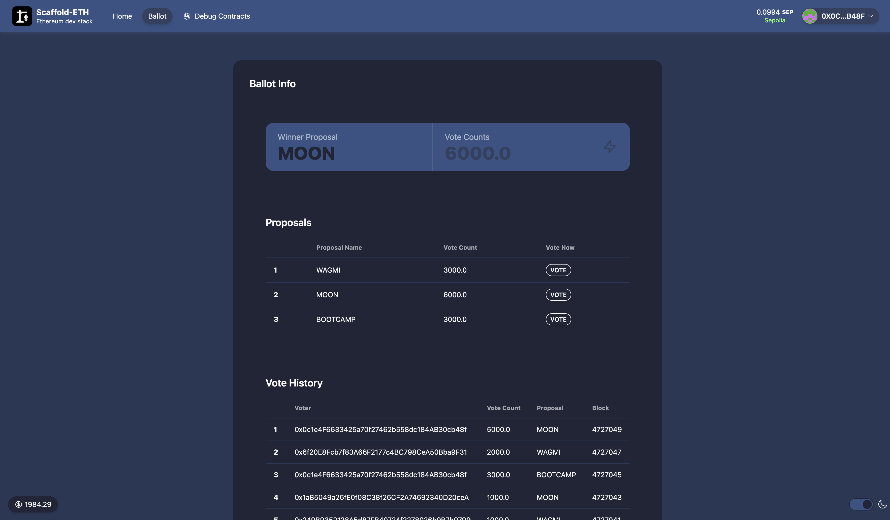

# Run project

- Inside `scaffold-eth-2` yarn start
- Inside `nest` npm run start

## Contracts

### Token: https://sepolia.etherscan.io/address/0x03944dcde2742eb652c98ad341c05f0cdff9a08a

### Ballot: https://sepolia.etherscan.io/address/0xCe88d38863c8CBF39cc5Df3Ef9CE68574DdDcf59

## Screenshots for UI

### Home Page

Contains information about the connected wallt and voting token infomation. User can mint token to wallet via an API call to the backend, where a wallet with `MINTER_ROLE` will mint the token for the connected wallet.

User can then `Self-delegate` the votes in the _Voting Token Info_ section (Only appears when the connected wallet haven't run delegation)

### Ballot Info Page

Display information for the winner of the ballot, historical voting records and ability for user to vote for their desired proposal

