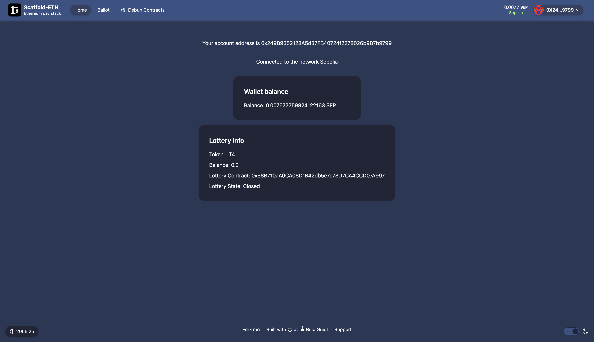

# Lottery UI

### Lottery Owner landing page before bet opens

### User view before bet opens

### Lottery Owner view after bet opens

### User click buy token and modal pops up

### User token balance after buying tokens

### User place bet modal and approval

### User redeem eth modal

### User redeem ETH transaction

### Owner fee redeemable screen

### Owner fee redeem transaction

